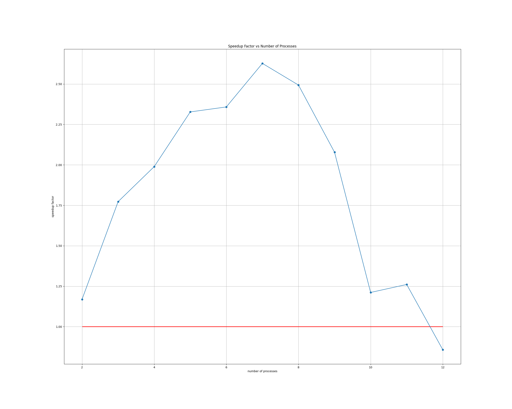

# Lab Work 1

## Task

Implement parallel version of the `sequential_main.c` program using MPI.
Algorithm working on `P` nodes divides matrix's rows into `P` and computes the elements
independently. After that the root reduces data from side nodes and validates result
with the one computed in sequential program.

## Speedup Factor

Assume that we have matrix of size `N x M`. Then the sequential runtime will equal

where t denotes time necessary for one element computation.
The parallel program runtime will be

where trec denotes time to receive one process segment.
Then the speedup factor can be derived as

As  is true, the algorithm
will work faster then one-thread version only for small number of used nodes.

