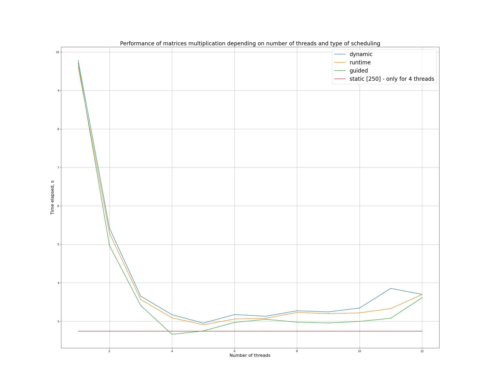

# Matrices multiplication with OpenMP

Program multiplies matrices with randomly generated integer elements.
The best performance for large size matrices was shown in static scheduling with batches
of size `dimension / N`, where N - number of threads, and without collapse option.

Guided mode (vanilla, without specified block size) showed to be the most efficient.
For all tested modes the best performance was shown on 4 threads, which correlates
with number of CPU cores on test device. After exceeding 8 threads, performance degrades
for all cases, which can be explained with hyperthreads amount overflow (2 hyperthreads for every core).

Use either CMakeLists.txt or combination of build.sh & run.sh scripts
(run.sh script is required to be used with `-n` option denoting number of threads).
Use `generate_data.sh [rows-in-a] [columns-in-a] [columns-in-b]` for generation of `result.dat` file for validation.
