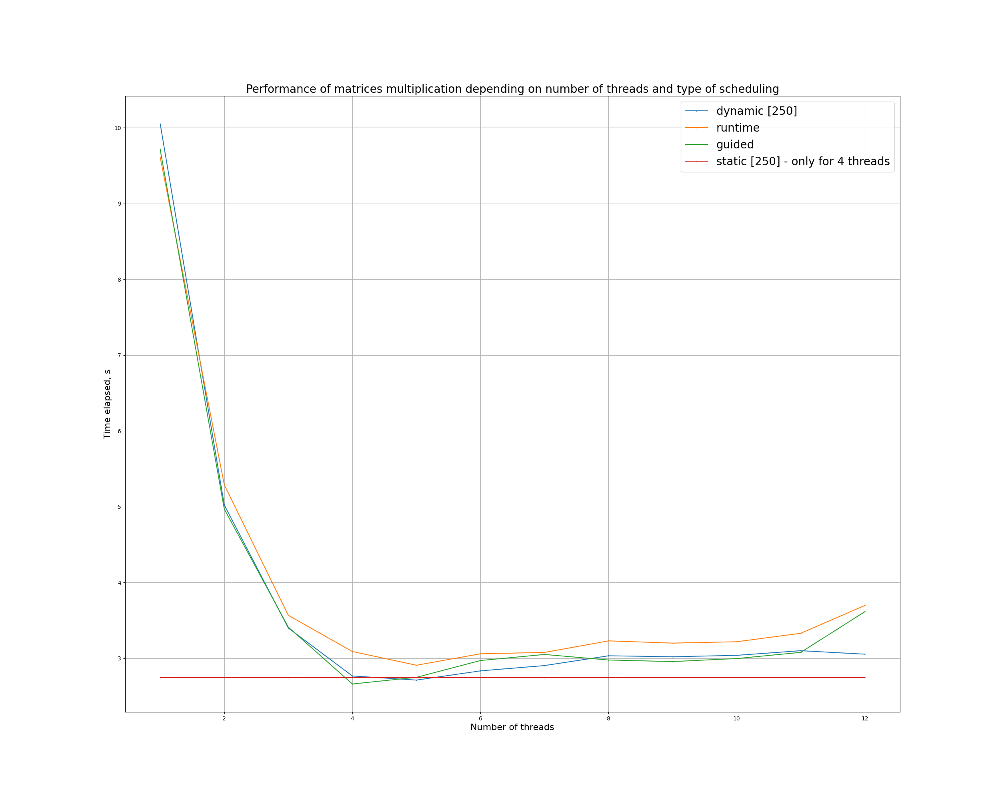

# Matrices multiplication with OpenMP

Program multiplies matrices with randomly generated integer elements.

## Performance analysis

Runs were conducted on matrices of size 1000 x 1000.
Static and dynamic schedulings were run with batches
of size `dimension / N_opt = 250`, where `N_opt = 4` - number of cores.

From graph one can infer that guided and dynamic schedulings showed the best performance.

For all tested modes the best performance was shown on 4 threads, which correlates
with number of CPU cores on test device. After exceeding 8 threads, performance degrades
for all cases, which can be explained with hyperthreads amount overflow (2 hyperthreads for every core).

Use either CMakeLists.txt or combination of build.sh & run.sh scripts
(run.sh script is required to be used with `-not` option denoting number of threads and with `ROWS-IN-A COLUMNS-IN-A COLUMNS-IN-B` params).
Use `generate_data.sh [rows-in-a] [columns-in-a] [columns-in-b]` for generation of `result.dat` file for validation.
